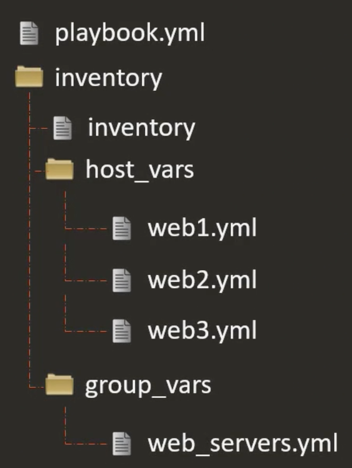

В предыдущих уроках мы объявляли переменные непосредственно в файле `inventory`:

```ini
[web_servers]
web1 ansible_host=172.20.1.100 dns_server=10.1.1.5
web2 ansible_host=172.20.1.101 dns_server=10.1.1.5
web3 ansible_host=172.20.1.102 dns_server=10.1.1.5
```

Если переменных много, то инвентарь может выглядеть нагромажденным. Лучше объявлять переменные в отдельных файлах для каждого хоста. Для этого нужно создать каталог `host_vars` и в нем создать файлы с названиями, соответствующими именам хостов:
- web1.yml
- web2.yml
- web3.yml

Далее нужно перенести переменные и их значения из файла `inventory` в эти новые файлы. Таким образом содержимое файла `inventory` останется таким:

```ini
[web_servers]
web1
web2
web3
```

Файл host_vars/web1.yml:

```yaml
ansible_host: 172.20.1.100
dns_server:   10.1.1.5
```

Файл host_vars/web2.yml:

```yaml
ansible_host: 172.20.1.101
dns_server:   10.1.1.5
```

Файл host_vars/web3.yml:

```yaml
ansible_host: 172.20.1.102
dns_server:   10.1.1.5
```

Очень важно называть файлы внутри каталога `host_vars` в соответствии с именами хостов в инвентаре.

Можно заметить, что во всех файлах хостов есть переменная `dns_server` одинаковая для всей группы. Ее можно перенести в каталог `group_vars` в файл с названием соответствующей группы - `web_servers`. В итоге получим следующую структуру:

Файл `inventory`:

```ini
[web_servers]
web1
web2
web3
```

Файл host_vars/web1.yml:

```yaml
ansible_host: 172.20.1.100
```

Файл host_vars/web2.yml:

```yaml
ansible_host: 172.20.1.101
```

Файл host_vars/web3.yml:

```yaml
ansible_host: 172.20.1.102
```

Файл group_vars/web_servers.yml:

```yaml
dns_server: 10.1.1.5
```

Файл `inventory` и каталоги `host_vars` и `group_vars` лучше перенести в отдельный каталог `inventory`:

<br>

Что если файл с переменными находится ни в одном из этих дефолтных каталогов? Например в файле: `/opt/apps/common-data/email/info.yml` со следующим содержимым:

```yaml
admin_email: admin@company.com
```

В этом случае нужно использовать опцию `include_vars`:

```yaml
- name: Deploy Web & DB Server
  hosts: web-db-server
  tasks:
  - include_vars:
      file: /opt/apps/common-data/email/info.yml   #указываем наш "нестандартный" файл
      name: email_data   #переменные из "нестандартного" файла будут загружены в эту переменную
  - mail:
      to: {{ email_data.admin_email }}
      subject: Service Alert
      body: Httpd Service is down
```

Если нам нужно посмотреть итоговый инвентарь, то можно воспользоваться командой:

`ansible-inventory -i inventory/ -y --list`.

Можно передать конкретный файл или весь каталог с инвентарем через опцию `-i`. Опция `-y` отобразит инвентарь в формате YAML (по дефолту JSON).

Предположим у нас есть некий playbook, который устанавливает сервер БД и веб-сервер на один хост:

```yaml
- name: Deploy Web & DB Server
  hosts: web-db-server
  tasks:
    - name: Install MySQL Packages
        << code hidden >>
    - name: Start MySQL Service
        << code hidden >>
    - name: Configure Database
        << code hidden >>
    - name: Install Python Flask Dependencies
        << code hidden >>
    - name: Run web-server
        << code hidden >>
```

Нам нужно переиспользовать эти таски в разных playbook-ах. Например мы хотим установить только сервер БД или только веб-сервер. Для этого мы разнесем таски по разным файлам внутри каталога `tasks`:

Файл `tasks/db.yml`:

```yaml
- name: Install MySQL Packages
    << code hidden >>
- name: Start MySQL Service
    << code hidden >>
- name: Configure Database
    << code hidden >>

```

Файл `tasks/web.yml`:

```yaml
- name: Install Python Flask Dependencies
    << code hidden >>
- name: Run web-server
    << code hidden >>
```

Далее мы можем включить эти таски в основной playbook с помощью опции `include_tasks`:

```yaml
- name: Deploy Web & DB Server
  hosts: web-db-server
  tasks:
    - include_tasks: tasks/db.yml
    - include_tasks: tasks/web.yml
```