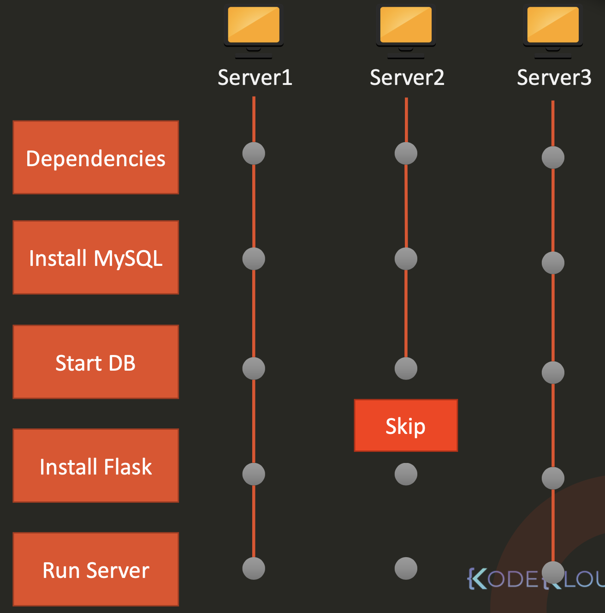

Предположим у нас есть некий playbook запущенный на одном хосте server1:

```yaml
- name: Deploy web application
  hosts: server1
  tasks:
    - name: Install dependencies
        << code hidden >>
    - name: Install MySQL Database
        << code hidden >>
    - name: Start MySQL Service
        << code hidden >>
    - name: Install Python Flask Dependencies
        << code hidden >>
    - name: Run web-server
        << code hidden >>
```

Если например таска `Start MySQL Service` завалится, тогда завалится и выполнение всего playbook-а и процесс его выполнения будет завершен.

Рассмотрим ситуацию когда мы запустили этот же playbook на нескольких хостах: `hosts: server1,server2,server3`.

Если таска `Start MySQL Service` завалится например на server2, ansible прекратит выполнения тасок на этом хосте и продолжит выполнять оставшиеся таски на других хостах.

<br>

В случае если нам важно получить консистентный результат и мы хотим, чтобы ansible остановил выполнение всего playbook-а, если произошел fail хотя бы на одном хосте, тогда нужно добавить опцию `any_errors_fatal: true`:

```yaml
- name: Deploy web application
  hosts: server1,server2,server3
  any_errors_fatal: true
  tasks:
    - name: Install dependencies
        << code hidden >>
    - name: Install MySQL Database
        << code hidden >>
    - name: Start MySQL Service
        << code hidden >>
    - name: Install Python Flask Dependencies
        << code hidden >>
    - name: Run web-server
        << code hidden >>
```

Что если нам нужен какой-то промежуточный вариант? Например мы запустили playbook на сотне хостов, некоторые из них ansible "отбросил" из-за возникших ошибок и продолжил выполнение на оставшихся. Мы можем принять некоторое количество фейлов и запустить playbook позже еще раз на хостах, на которых ранее возникли ошибки. Но в то же время нам не нужно, чтобы по результату выполнения всего playbook полностью сконфигурированными оказались только 2 из 100 хостов. Если большое количество хостов фейлится в процессе выполнения playbook, значит что-то действительно не так и нам нужно обратить на это внимание. В этом случае мы можем добавить условие, которое говорит - если более 30% хостов завалилось на выполнении определенной таски, то действительно есть какая-то проблема и нужно завершить выполнение playbook. Для этого нужно добавить опцию `max_fail_percentage: 30`:

```yaml
- name: Deploy web application
  hosts: server1,server2,server3
  max_fail_percentage: 30
  tasks:
    - name: Install dependencies
        << code hidden >>
    - name: Install MySQL Database
        << code hidden >>
    - name: Start MySQL Service
        << code hidden >>
    - name: Install Python Flask Dependencies
        << code hidden >>
    - name: Run web-server
        << code hidden >>
```

Также мы добавили таску в конце playbook, которая будет посылать нотификацию по почте о том, что веб-сервер сконфигурирован. Но успешность выполнения этой таски нам не критична, и мы не хотим, чтобы выполнение playbook прервалось из-за невозможности отправки нотификации (например SMTP-сервер сбоит). Для игнорирования ошибок существует опция `ignore_errors: yes`. В этом случае возникшая ошибка будет проигнорирована, а выполнение playbook продолжено.

```yaml
- name: Deploy web application
  hosts: server1,server2,server3
  any_errors_fatal: true
  tasks:
    - name: Install dependencies
        << code hidden >>
    - name: Install MySQL Database
        << code hidden >>
    - name: Start MySQL Service
        << code hidden >>
    - name: Install Python Flask Dependencies
        << code hidden >>
    - name: Run web-server
        << code hidden >>
    - mail:
        to: admin@company.com
        subject: Server Configured
        body: Web server has been configured
      ignore_errors: yes
```

Далее мы решили добавить небольшой health check. Когда веб-сервер работает, он сохраняет логи в файл `server.log`. Мы хотим проверять этот файл на наличие ошибок, и, если они там есть, то нужно завершить работу playbook. Для этого существует опция `failed_when`:

```yaml
- name: Deploy web application
  hosts: server1,server2,server3
  any_errors_fatal: true
  tasks:
    - name: Install dependencies
        << code hidden >>
    - name: Install MySQL Database
        << code hidden >>
    - name: Start MySQL Service
        << code hidden >>
    - name: Install Python Flask Dependencies
        << code hidden >>
    - name: Run web-server
        << code hidden >>
    - command: cat /var/log/server.log
      register: command_output
      failed_when: 'ERROR' in command_output.stdout
    - mail:
        to: admin@company.com
        subject: Server Configured
        body: Web server has been configured
      ignore_errors: yes
```

Также в уроке про Block есть секция про обработку ошибок на примере ключевого слова Rescue.