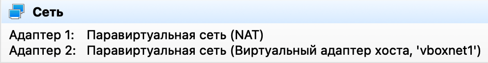

Скачиваем готовый образ ВМ с сайта [osboxes](https://www.osboxes.org/centos/).

Настраиваем сеть как на скриншоте:

<br>

Один адаптер для подключения по ssh, другой для выхода в интернет.

Один адаптер нужно просто включить через nmtui.

Для второго нужно создать новый профиль подключения: `nmcli connection add type ethernet ifname enp0s8`.

Переименовать можно опять же через nmtui.

Обновляем пакеты, задаем timezone, создаем нового пользователя и добавляем в группу wheel.

Далее выключаем эталонную ВМ и выполняем связное клонирование с генерацией новый mac-адресов.

Клонируем три ВМ - ansible-controller, ansible-target1, ansible-target2.

Переименовываем машины в ansiblecontroller, target1 и target2 соответственно: `vim /etc/hostname`.

Меняем также содержимое `/etc/hosts` и перезагружаем ВМ:

```bash
127.0.0.1   localhost ansiblecontroller
::1         localhost ansiblecontroller
```

Ставим ansible по инструкции с официального сайта.

Логинимся по ssh с ansiblecontroller на target1 и выходим.

Создаем тестовый проект и инвентарь:

```bash
mkdir test-project
vim inventory.txt
target1 ansible_host=192.168.59.104 ansible_ssh_pass=Passw0rd
target2 ansible_host=192.168.59.105 ansible_ssh_pass=Passw0rd
```

Ставим дополнительно пакет sshpass: `sudo dnf install sshpass`.

Проверяем связность: `ansible -i inventory.txt target1 -m ping`.

If installing Ansible from a package manager, the latest `ansible.cfg` file should be present in `/etc/ansible`, possibly as a .rpmnew file (or other) as appropriate in the case of updates.

If you installed Ansible from pip or from source, you may want to create this file in order to override default settings in Ansible.

Сгенерировать конфигурационный файл с закомментированными настройками: `ansible-config init --disabled > ansible.cfg`.

Далее можно создать директорию `/etc/ansible` и переместить этот файл туда.

Редактируем опцию: `host_key_checking=False`.