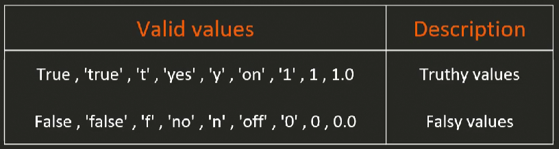

### String Variables

`username: "admin"`

### Number Variables

`max_connections: 100`

### Boolean Variables

`debug_mode: true`

<br>

### List Variables

```yaml
packages:
  - nginx
  - postgresql
  - git
```

```yaml
- name: Install Packages Playbook
  hosts: your_target_hosts
  vars:
    packages:
      - nginx
      - postgresql
      - git

  tasks:
    - name: Display all packages
      debug:
        var: packages

    - name: Display the first package
      debug:
        msg: "The first package is {{ packages[0] }}"

    - name: Install packages using package manager (apt/yum)
      become: true
      debug:
        msg: "Installing package {{ item }}"
      loop: "{{ packages }}"
```

### Dictionary Variables

```yaml
user:
  name: "admin"
  password: "secret"
```

```yaml
- name: Access Dictionary Variable Playbook
  hosts: web_servers
  vars:
    user:
      name: "admin"
      password: "secret"

  tasks:
    - name: Display the entire user dictionary variable
      debug:
        var: user

    - name: Access specific values in the dictionary
      debug:
        msg: "Username: {{ user.name }}, Password: {{ user.password }}"
```